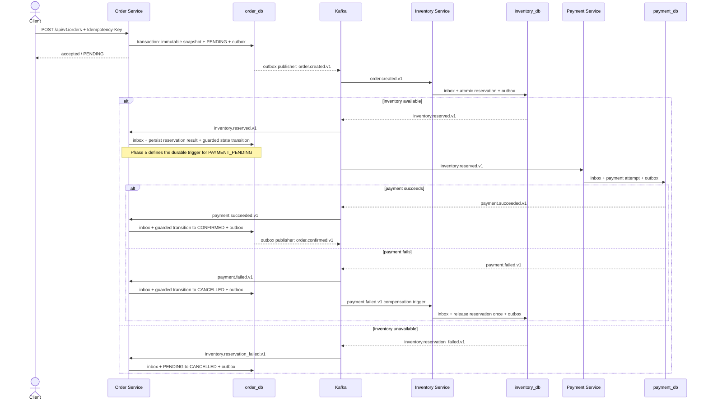

# Checkout Saga

`PENDING`, `INVENTORY_RESERVED`, `PAYMENT_PENDING`, `CONFIRMED`, `CANCELLED`, and `FAILED` form the minimum explicit order-state vocabulary. The diagram deliberately does not collapse `INVENTORY_RESERVED` and `PAYMENT_PENDING` into one database transaction: Phase 5 must define the durable observation or contract that triggers the latter. `FAILED` is reserved for a Phase 5-defined terminal failure that is not represented by normal business cancellation. The complete transition table, guards, history requirements, and emitted events are Phase 5 deliverables.

Kafka ordering is only partition-local. There is no ordering guarantee between inventory and payment topics or between different aggregate keys. The Order consumer must therefore combine Inbox deduplication, conditional state transitions, and a Phase 5-defined retry/reconciliation policy so that an out-of-order payment event cannot force an illegal transition.

The diagram does not define final payloads, timeouts, late payment, unknown provider outcomes, refund semantics, or every compensation event. Those are Phase 5 design decisions and must be fixed before checkout implementation.
