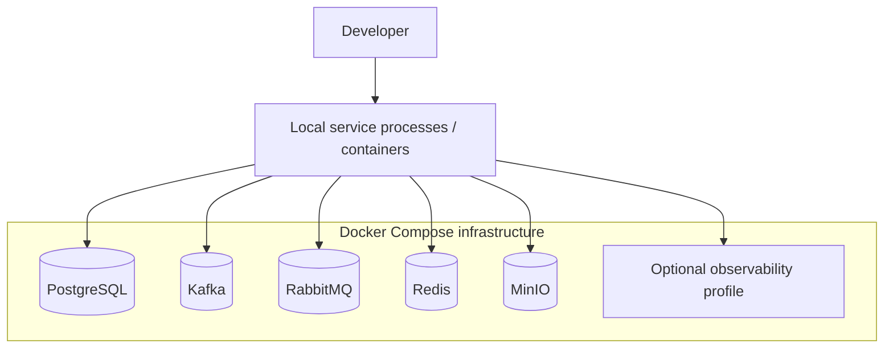
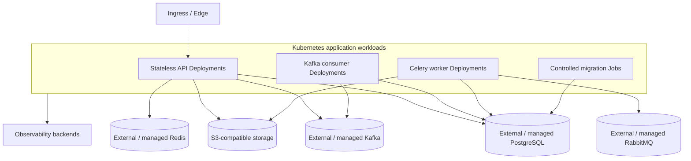

# Deployment Evolution

## Local development — Phase 1

## Kubernetes target — Phase 9+

Stateful dependencies may run in-cluster for a demo environment, but application code is configured so production can use managed/external services without topology-dependent business logic.
