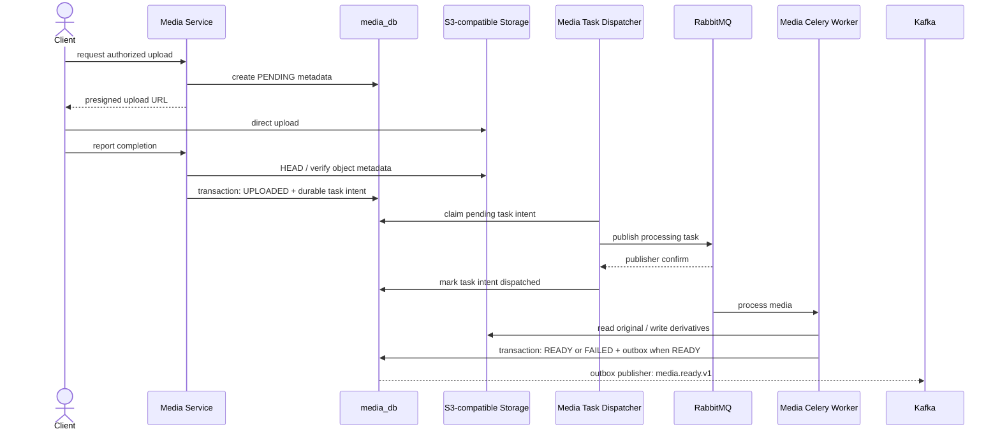
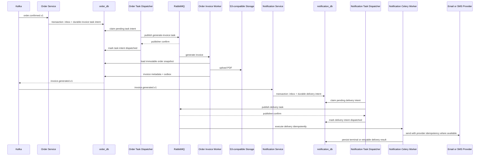

# Media and Invoice Flows

## Direct media upload

## Generated invoice

The dispatcher is a bounded-context component, not an in-memory continuation of the HTTP or Kafka handler. The exact claiming, confirmation, retry, and recovery protocol must be decided and validated in the first phase that introduces a critical Kafka-to-RabbitMQ flow; invoice-specific behavior is completed in Phase 6.
