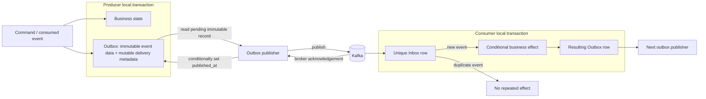

# Transactional Outbox and Inbox

Business state and the Outbox row are written together. The event identity, type, key, headers, and payload in that row are immutable; delivery metadata such as claim state, attempts, last error, and `published_at` may change. The publisher reads only the Outbox record and never reconstructs an event from current business tables. If Kafka is unavailable after commit, the row remains pending. If publication succeeds and the publisher crashes before marking success, Kafka may receive a duplicate; the Inbox and domain guards make that safe.
