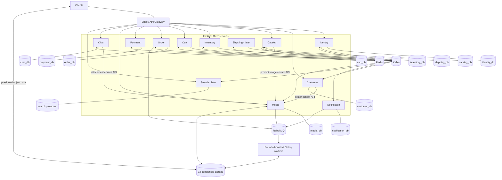

# Service Container View

Each database edge denotes exclusive ownership. No horizontal database query exists between services. Media interactions are control-plane calls; authorized clients transfer object bytes directly with narrowly scoped presigned requests.
