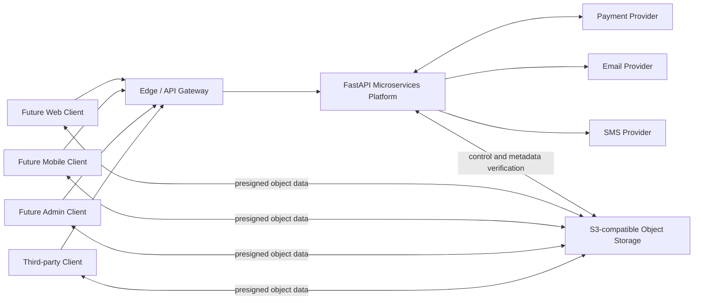

# System Context

The payment-provider relationship is bidirectional because the platform sends provider commands and receives authenticated callbacks/webhooks. The edge handles routing, TLS, request limits, headers, and WebSocket forwarding. Services still validate authentication and enforce domain/resource authorization. Authorized interactive transfers use presigned client-to-storage data paths. Context-owned workers may also read or write object bytes directly through the `ObjectStorage` adapter, while API request handlers retain the authorization/metadata control plane and do not proxy large transfers.
